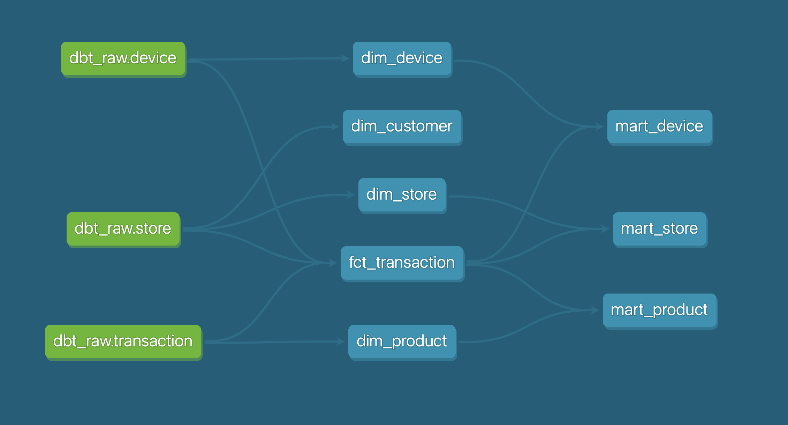

# SumUp Take Home Challenge

### How to Run It

#### Prerequisites

- Docker installed on your machine.

#### Steps

1. Start Docker containers (Postgres + dbt):

```bash
docker compose up -d
```

2. (Optional) Connect to Postgres:

```bash
docker exec -it dbt_postgres psql -U dbt_user -d dbt_db
```

3. Access the dbt container:

```bash
docker exec -it dbt_runner bash
```

4. (Optional) Debug dbt:

```bash
dbt debug
```

5. Upload source data:

```bash
dbt seed
```

6. Run dbt models:

```bash
dbt run
```

7. Generate dbt documentation:

```bash
dbt docs generate
```

8. Serve dbt documentation UI:

```bash
dbt docs serve --host 0.0.0.0 --port 8080
```

Access UI at [http://localhost:8080](http://localhost:8080).

9. (Optional) Run tests:

```bash
dbt test
```

Run tests for a specific model:

```bash
dbt test --models <model_name>
```

#### Other Useful Commands

- `Ctrl + D` — Disconnect from container
- `docker compose down` — Stop containers

---

### Queries to answer this challenge questions are in the `questions_and_answers.sql` file.

You can run the queries using any SQL client tool (e.g., DBeaver). To connect to the database, use the credentials specified in the `profiles.yml` file.

---

### Design

- **Database**
  Postgres (default choice; not ideal for large-scale analytics).

- **Data Warehouse Layers**

  1. **Raw layer (`dbt_raw` schema):** Uploaded raw files. I used dbt seed to upload those files, but in the real setup the data will be loaded from the source by the pipeline, so we won't need dbt seed, we can just reference those tables as sources instead.
  2. **Staging layer (`dbt_stg` schema):** Enriched, cleaned raw data. Snowflake schema.
  3. **Data Mart layer:** Denormalized data to answer analytical questions.

- **Lineage Graph**
  

#### Notes

- Sensitive data (e.g., card information) is masked. The CVV field is excluded from the model, as it’s unlikely to be needed for analytics. since it probably won't be used for analytics. 
- Added tests for unique and not null fields.
- `dim_customer` table added for customer analysis.

---

### Assumptions

- Raw `.xlsx` files were converted to `.csv` to use dbt seeds. dbt is mainly for transformations, not raw uploads.
- `category_name` in `transaction` relates to the transaction (generated field).
- No `dim_location` table; assume 1:1 relation between address and store to reduce joins.
- Some store transactions appear before store creation due to generated data; negative values may appear in metrics like "Average time for a store to perform first 5 transactions."

---

### Ideas for the Future

- Schedule dbt runs with Airflow.
- Expand documentation.
- Enrich the database with additional data sources.
- Implement SCD2 (or other historical tracking) for trend analysis.
- Add a reporting layer for denormalized queries optimized for BI tools.
- Implement data quality (DQ) checks and alerting for anomalies.
